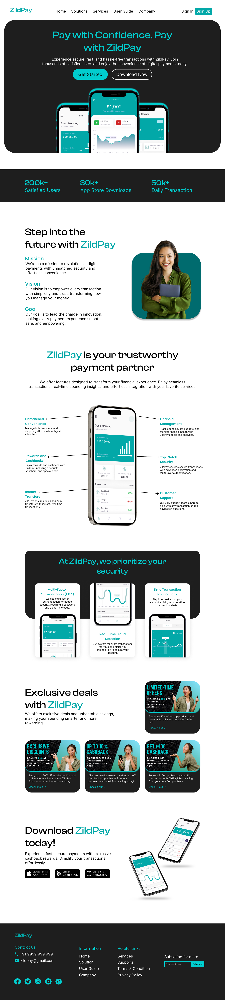

# ZildPay

ZildPay is an E-wallet App designed to provide users with a secure, efficient, and user-friendly platform for managing their digital finances.

## Purpose

The purpose of this project is to design a website for the ZildPay E-wallet app, prioritizing trust and reliability. The goal is to create an interface that users find intuitive and secure, encouraging confidence in managing their financial transactions online.

## Demo Link

You can interact with the design demo on Figma:

[ZildPay UI/UX Design Demo](https://www.figma.com/proto/jN9hX3UwHR4G1lgqdE6ZTy/Personal-Project-1?page-id=44%3A3&node-id=177-71&viewport=-24%2C288%2C0.2&t=B6VclRxjIUEPFPqU-1&scaling=scale-down-width&content-scaling=fixed)

You can also view the project on Behance:

[ZildPay UI/UX Design on Behance](https://www.behance.net/gallery/203156191/ZildPay)

## Design Preview

Check out the design preview image to see the new interface:

